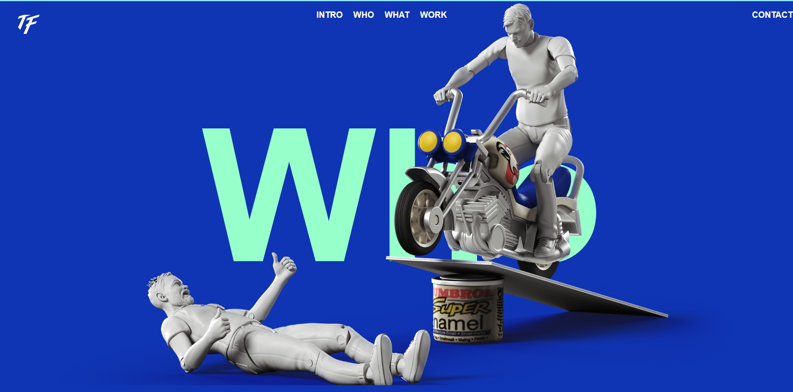
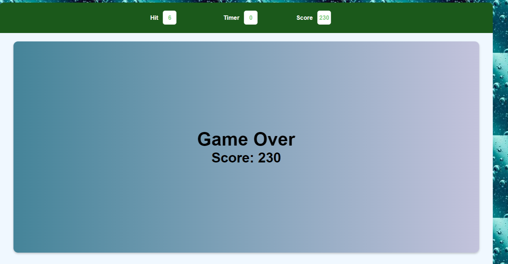
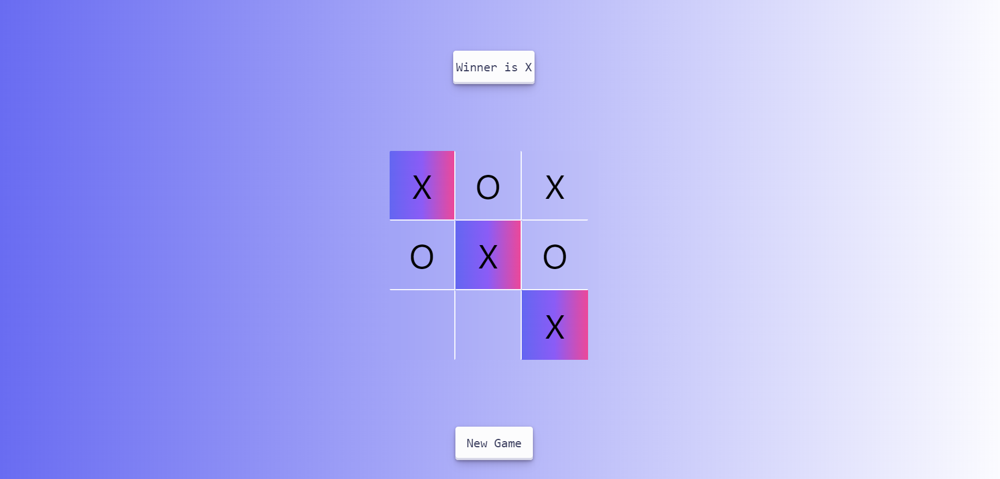

# Frontend Project Showcase 

Welcome to the Frontend Project Showcase repository! This README serves as your hub to explore a collection of  exciting frontend projects. Each project has its own section with a preview image and a brief overview of its purpose and features. Whether you're a developer or interested in exploring various web development concepts, this repository has something for you.  

> ## Technologies Used 
* HTML 5
* CSS 3 
* TAILWIND CSS
* JAVASCRIPT 
* JAVSCRIPT LIABRARIES
  *  Gsap 
  *  Locomotive
  * ScrollTrigger
   

--- 
> # Project 1 
### Project Preview Images 
  

---

### Key Featuers 
 * Engaging User Interactions: Experience animations triggered    by user actions, such as clicks, hovers, and scrolls.
* Seamless Event Listeners: Dive into the code that utilizes event listeners to capture user input and initiate dynamic animations. 

*  Gsap  magic or Animation like ScrollTrigger 
``` 
gsap.from( 
    scrollTrigger :{
         Properties
    }
)
gsap.to()   
```

---
___ 

 > # Project 2  

 ### Bubble Hit Game using Event Bubbling 
 This project demonstrates a simple bubble hit game where players aim to hit a target number within a specified time. The game leverages event bubbling to efficiently handle multiple bubble interactions. 

 ## Features

Randomly generated target numbers and bubbles.
Interactive UI that allows players to hit bubbles.
Score tracking and display of current score.
Dynamic bubble creation and removal.
  
; 
;

---
---
> # Project-3
### Tic-Toc-Toe Game  


This Project demonstrate simple Tic-Toc -toe game . The Game leverages the Dom mainuplation and Event Handling .  

 

### Tech Used 
* Tailwind Css 
* Javascript 
* Html   

###### I developed this project independently, but it does have one bug. If anyone is interested in helping resolve it, please feel free to contribute.

> # Project-4 
 
 ### GYM -FITNESS WEBSITES